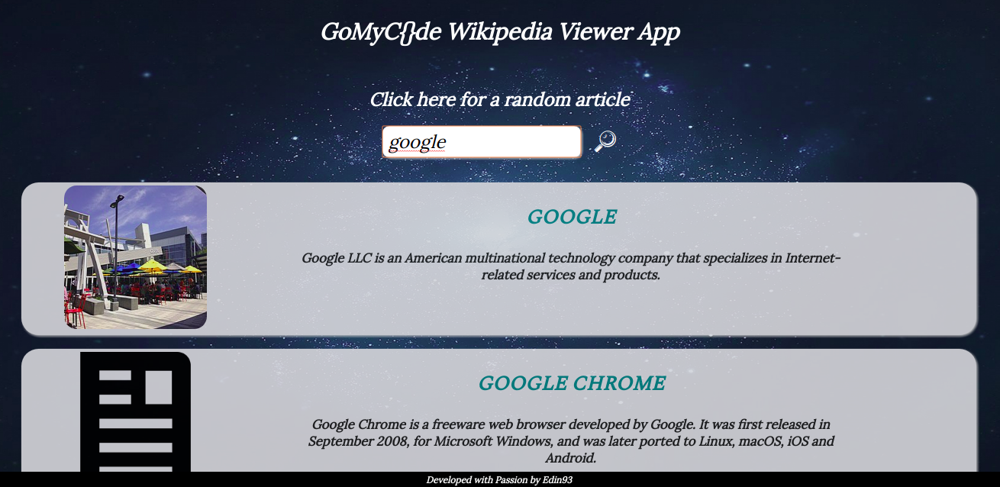

# Wikipedia Viewer App

## This project is part of the [gomycode](https://gomycode.tn) fullstack JS cursus.

## This website is responsive.

## User Stories

1. <strong>User Story:</strong> The user can search Wikipedia entries in a search box and see the resulting Wikipedia entries.

2. <strong>User Story:</strong> The user can click a button to see a random Wikipedia entry.

    

# What did I learn:

1. How to use the Wiki API.

2. The basics of XHR (XMLHTTPRequest), AJAX, JSON.

3. Manipulate the DOM from an API's outcome.

4. The very basics of the OOP..